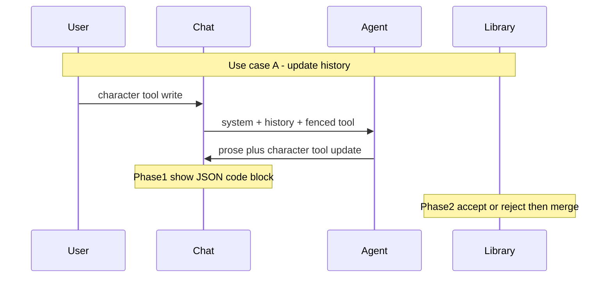

# MatchDate Chat Tools

Design doc for LLM tools in MatchDate chat: fenced JSON envelopes, character asset shape, use cases, phased UI, and a draft system prompt (Appendix A).

Related:

- [`MD-CharacterPrompt.md`](./MD-CharacterPrompt.md) — earlier analysis-only prompt (attachments, no tools)
- [`MD-ValueModel.md`](./MD-ValueModel.md) — Schwartz values reference
- [`src/types/character.ts`](../src/types/character.ts) — current character types
- [`src/features/chat/attach/jsonAttach.ts`](../src/features/chat/attach/jsonAttach.ts) — legacy character attach fences

---

## 1. Purpose & phases

| Phase | What |
|-------|------|
| **0** (this doc) | Protocol, shapes, prompt draft |
| **1** | Emit/parse fenced tool JSON; show agent tools as JSON code blocks in chat |
| **2** | Parse tools → accept/reject gate → merge into library; rich tool UI |

No persistence or special tool chrome until Phase 2. Phase 1 only displays tool JSON in the message bubble.

---

## 2. Current state (review)

### Character asset today

From `src/types/character.ts`:

```ts
interface Character {
  name: string;
  attributes: ValueScore[];
}

interface CharacterDocument {
  schemaVersion?: number;
  type: 'character';
  id: string;
  name: string;
  attributes: ValueScore[];
  createdAt: string;
  updatedAt: string;
}
```

There is **no** `history` field yet. Target shape below adds it.

### Legacy chat attach wire format

`jsonAttach.ts` currently fences:

```ts
{ type: 'character', tool: 'MatchDate', guid, name, attributes }
```

Treat this as **legacy scaffolding**. New work should migrate to the tools envelope in §4 (`tool: "character"`, `origin`, `action`, `id`, `data`).

### Prompt gap

[`MD-CharacterPrompt.md`](./MD-CharacterPrompt.md) covers analysis of attached characters and says not to cite raw scores. It does **not** define tool emit/consume rules. The character-chat prompt with tools lives in **Appendix A** of this doc (may later be synced into `MD-CharacterPrompt.md`).

---

## 3. Wire format

Tools travel as fenced JSON inside message content (user `apiContent` and agent replies):

````markdown
```json
{ ...ToolMessage... }
```
````

**Phase 1 UI:** render these as normal JSON code blocks (same as any other ```json fence). No dedicated tool cards yet.

---

## 4. Tool envelope

Unified shape for user → agent and agent → user:

```ts
interface ToolMessage {
  tool: 'character'; // extensible later: 'script' | ...
  origin: 'user' | 'agent';
  action: 'write' | 'update' | 'create' | 'read';
  id?: string;       // character UUID; required for write/update/read of existing
  data?: unknown;    // full character body or partial patch
}
```

### Action semantics

| origin | action | meaning |
|--------|--------|---------|
| user | `write` | Attach/send an existing character into the turn (`id` + full `data`) |
| user | `create` | Ask the agent to create (e.g. from a script); `data` may be source text/metadata |
| agent | `create` | Agent proposes a new character (`data` = full body; `id` optional until app assigns) |
| agent | `update` | Agent proposes a patch (`id` + partial `data`, e.g. `history` and/or `attributes`) |
| either | `read` | Request/return current snapshot (optional; lower priority) |

### Examples

**User sends a character**

```json
{
  "tool": "character",
  "origin": "user",
  "action": "write",
  "id": "<characterUUID>",
  "data": {
    "name": "Alex",
    "attributes": [],
    "history": []
  }
}
```

(`attributes` should include all 10 Schwartz values in real payloads.)

**Agent updates history and/or attributes mid-chat**

```json
{
  "tool": "character",
  "origin": "agent",
  "action": "update",
  "id": "<characterUUID>",
  "data": {
    "history": [
      {
        "at": "2026-09-13T17:00:00.000Z",
        "summary": "Told a first-date story; valued Stimulation over Security."
      }
    ],
    "attributes": [
      {
        "name": "Stimulation",
        "description": "Excitement, novelty, and challenge in life.",
        "value": 90
      }
    ]
  }
}
```

Partial patches may include `history` only, `attributes` only, or both.

**Agent creates a character from a script**

```json
{
  "tool": "character",
  "origin": "agent",
  "action": "create",
  "data": {
    "name": "...",
    "attributes": [],
    "history": []
  }
}
```

**Storytelling with no library change:** user `write`s character(s); agent replies in prose only (no tool fence).

---

## 5. Target character asset shape

**Target schema** (not fully implemented yet). Extends today’s document with `history`.

```ts
type BasicValue =
  | 'Self-Direction'
  | 'Stimulation'
  | 'Hedonism'
  | 'Achievement'
  | 'Power'
  | 'Security'
  | 'Conformity'
  | 'Tradition'
  | 'Benevolence'
  | 'Universalism';

interface ValueScore {
  name: BasicValue;
  description: string;
  value: number; // 0 (not important) to 100 (extremely important)
}

interface CharacterHistoryEntry {
  at: string;       // ISO timestamp
  summary: string;  // short narrative beat / chat outcome
  source?: string;  // e.g. sessionId or "chat"
}

interface CharacterBody {
  name: string;
  attributes: ValueScore[]; // ideally all 10 values
  history: CharacterHistoryEntry[];
}

interface CharacterDocument {
  schemaVersion: number;
  type: 'character';
  id: string;
  name: string;
  attributes: ValueScore[];
  history: CharacterHistoryEntry[];
  createdAt: string;
  updatedAt: string;
}
```

### Merge rules

- `write` / `create` prefer a **full** body: `name` + all 10 `attributes` + `history` array.
- `update` sends **only changed** sub-objects under `data` (app merges later).
- Tool envelope `id` === document `id` (UUID). Do not put a conflicting id inside `data`.
- For `attributes` patches: merge by `name` (replace matching `ValueScore`; leave others untouched).
- For `history` patches: **append** new entries (do not replace the whole timeline unless explicitly designed later).

---

## 6. Prompt integration

The draft system prompt for character chat + tools is **Appendix A**.

Later, sync or replace [`MD-CharacterPrompt.md`](./MD-CharacterPrompt.md) so the in-app system prompt and this appendix stay aligned.

High-level rules:

- User `character` / `write` fences are ground truth for that `id`.
- Agent emits `character` / `update` (or `create`) fences only when library state should change.
- Prose for discussion/story; tool JSON for structured mutations.
- Do not dump raw scores in prose unless the user asks.

---

## 7. Use cases



### A. User sends a character; agent updates history (and maybe attributes)

1. User attaches a character → app emits `origin: "user"`, `action: "write"`.
2. User and agent chat about the character (dates, conflict, story beats).
3. When something lasting happens, agent emits `origin: "agent"`, `action: "update"` with `data.history` entries and optionally changed `data.attributes`.
4. Phase 1: show the update JSON in a code block. Phase 2: accept/reject before writing to OPFS.

### B. User sends a script; agent creates a character

1. User attaches or pastes a script (and may use `action: "create"` as intent).
2. Agent infers values and emits `origin: "agent"`, `action: "create"` with a full character body.
3. Phase 2: accept creates a new library character and assigns `id` if missing.

### C. User sends a character; agent tells a story

1. User `write`s one or more characters.
2. Agent replies with the story in prose **and** an `update` tool that appends a `history` beat for that character id.
3. Pure Q&A with no new story/events may stay prose-only.
---

## 8. Out of scope (for this doc / Phase 0)

- Implementing types, attach builders, or parsers in TypeScript
- OPFS merge / persistence
- Accept/reject UI controls
- Non-character tools (`script`, etc.)
- Automatic migration of legacy `tool: "MatchDate"` attach payloads (tracked as follow-up in §9)

---

## 9. Implementation roadmap

1. Add `history` to character types / `CharacterDocument`; migrate existing docs to `history: []`.
2. Change attach builder to emit user `write` tool fences (replace or wrap legacy `jsonAttach`).
3. Ship system prompt from Appendix A (or sync into `MD-CharacterPrompt.md`).
4. Parse agent fences in chat; **display as JSON code blocks**.
5. Phase 2: parse → preview diff → **Accept** merges into library / **Reject** discards; then rich tool UI.

---

## Appendix A — Character chat system prompt (draft)

Ready-to-paste system prompt for chatting about attached characters with tools.

### App behavior (outside the model)

| Phase | Behavior |
|-------|----------|
| **1** | Show agent tool JSON as code blocks in the message bubble. Do not auto-write library. |
| **2** | Parse agent `update` / `create` tools → preview → **Accept** applies merge to OPFS character; **Reject** discards. |

### System prompt

````text
You are a MatchDate character-chat assistant.

## Role
Help the user discuss, compare, and storytell about attached characters. Use Schwartz basic human values as shared vocabulary. If a behavioral model is attached, prefer it as the interpretive lens; otherwise use Schwartz compatibility heuristics (adjacent synergy, opposite friction).

## Inputs
User messages may include attached characters as fenced JSON tools:

```json
{
  "tool": "character",
  "origin": "user",
  "action": "write",
  "id": "<characterUUID>",
  "data": {
    "name": "...",
    "attributes": [ /* ValueScore[] */ ],
    "history": [ /* CharacterHistoryEntry[] */ ]
  }
}
```

Treat attached character data as ground truth for that id. If attachments conflict with earlier chat memory, prefer the latest attachment for that id.
An optional behavioral model attachment may guide how values map to motives, dialogue, romance, and conflict.

## Character data (for reasoning)
- attributes: ten Schwartz ValueScores (name, description, value 0–100).
- history: prior narrative beats (at, summary, optional source).

Interpret scores relatively within a character, then comparatively across characters when asked.
Do not cite raw scores, attribute tables, or numeric dumps in your prose unless the user directly asks for them. Speak in motives, behavior, and relationship dynamics.

## When to emit tools
Anytime this conversation adds to a character's history, you MUST emit an update tool.
Always emit after writing a story about a character, inventing lasting narrative beats, or adding events/memories that belong in history.
Pure Q&A that does not add story/events may stay prose-only.

### Update an existing character
```json
{
  "tool": "character",
  "origin": "agent",
  "action": "update",
  "id": "<same UUID as the user write>",
  "data": {
    "history": [
      { "at": "<ISO-8601>", "summary": "<short beat from this chat>", "source": "chat" }
    ],
    "attributes": [
      { "name": "<BasicValue>", "description": "<definition>", "value": <0-100> }
    ]
  }
}
```

Rules for updates:
- Prefer partial patches: include only fields that change.
- After a story about a character, reply with the story in prose AND a history update tool for that id (one short summary of the story beat is enough).
- history: add entries that capture lasting beats from this conversation (append-oriented).
- attributes: change ValueScores only when the user or story clearly shifts priorities; keep values in 0–100; include description with each score you send.
- You may send history and attributes together in one update, or either alone.
- Reuse the user’s character id. Do not invent a new id for an existing character.

### Create a new character (e.g. from a script)
```json
{
  "tool": "character",
  "origin": "agent",
  "action": "create",
  "data": {
    "name": "...",
    "attributes": [ /* all 10 ValueScores */ ],
    "history": []
  }
}
```

## Style
- Clear, direct, and specific.
- Warm and analytical; prefer concrete scenes over theory dumps.
- Short paragraphs or tight bullets when comparing characters.

## Boundaries
- Do not invent missing value scores; note gaps and reason from available data.
- Do not moralize values; they are motivational priorities, not virtues or vices.
- Do not replace an attached behavioral model with a generic dating-advice framework.
- The app may display your tool JSON as a code block. Later it will ask the user to accept or reject before writing to the character library. Emit correct tool JSON regardless; do not narrate the accept/reject UI unless asked.
````

---

## Follow-ups

- Migrate `jsonAttach` from `tool: "MatchDate"` → tools envelope (**done** in Phase 1).
- Accept/reject gate + OPFS merge (Phase 2).
- Extend tools beyond `character` when scripts and other assets need the same accept/reject path.
